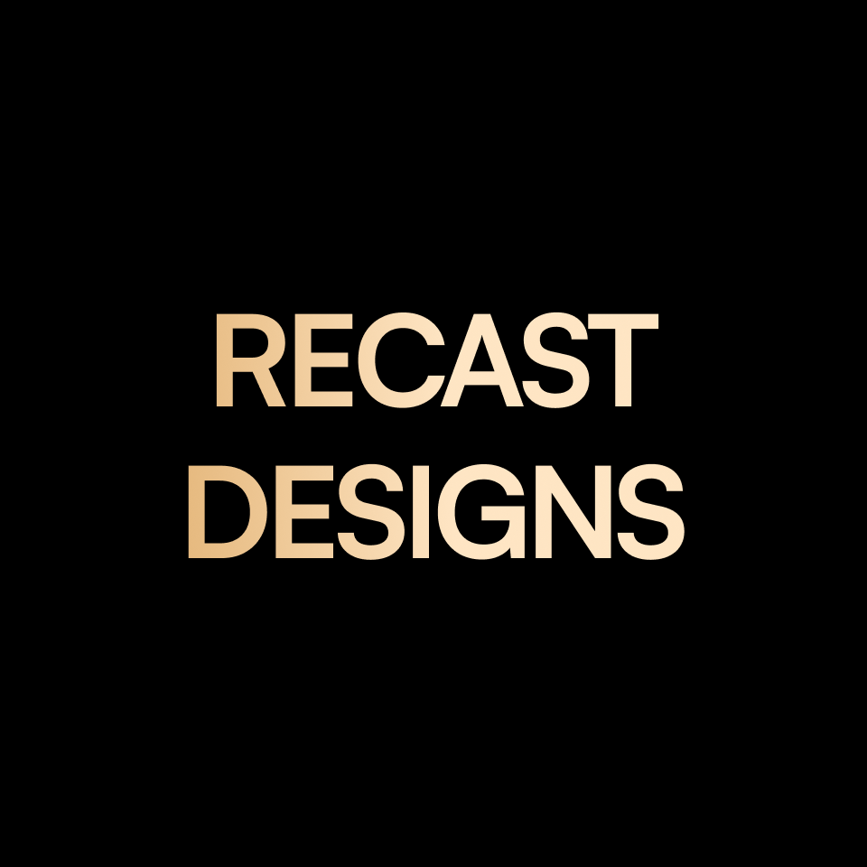

<div align="center">

# Recast Designs

<!-- App Icon -->


### A premium Flutter restaurant UI experience


</div>

---

## 📱 Splash Screen

<!-- Replace with your splash screen screenshot -->
> 


---

## 🎥 App Demo

<!-- Replace the path below with your actual screen recording -->

https://github.com/user-attachments/assets/9c8ffd0a-bec7-4c95-9bf6-c690911368ae


---

## 🗂 Project Structure

```
lib/
├── main.dart                          # App entry point, SystemChrome setup
├── my_app.dart                        # MaterialApp + ScreenUtil init
│
├── core/                              # Shared, app-wide code
│   ├── constants/
│   │   ├── app_assets.dart            # Asset path constants
│   │   ├── app_colors.dart            # Color palette (gold, black, etc.)
│   │   └── app_fonts.dart             # Font family constants
│   │
│   ├── extensions/
│   │   └── navigation_extension.dart  # context.pushNamed() helper
│   │
│   ├── functions/
│   │   └── spacer.dart                # verticalSpacer() / horizontalSpacer()
│   │
│   ├── routing/
│   │   ├── app_router.dart            # onGenerateRoute — maps routes to screens
│   │   └── router.dart                # Route name constants (Routes.xxx)
│   │
│   ├── theme/
│   │   └── app_theme.dart             # ThemeData configuration
│   │
│   └── widgets/                       # Reusable global widgets
│       ├── faded_banner.dart          # Hero image with bottom fade gradient
│       ├── faded_banner_with_arrow_back.dart  # faded_banner + back button
│       └── gradient_gold_text.dart    # ShaderMask gold gradient text
│
└── features/
    │
    ├── home/                          # Home screen feature
    │   ├── domain/
    │   │   └── models/
    │   │       └── food_menu.dart     # FoodMenu model + dummyData list
    │   │
    │   └── presentation/
    │       ├── views/
    │       │   └── home_screen.dart   # Main home screen
    │       │
    │       └── widgets/
    │           ├── blurred_arrow_back.dart            # Frosted back button
    │           ├── small_subtitle_with_gradient_title.dart  # Section headers
    │           ├── food_menu_card.dart                # Grid card entry point
    │           └── food_menu_card/
    │               ├── food_menu_background_image.dart  # Card image + blur layers
    │               ├── food_menu_title_with_price.dart  # Title & price badge
    │               └── trending_container.dart          # "Trending" label badge
    │
    └── food_details/                  # Food detail screen feature
        ├── domain/                    # (reserved for future use)
        │
        └── presentation/
            ├── manager/               # BLoC state management
            │   ├── food_details_cubit.dart   # addToOrder, overlayComplete, button press
            │   └── food_details_state.dart   # Initial, ShowOverlay states + buttonPressed
            │
            ├── views/
            │   └── food_details_screen.dart  # Detail screen (StatelessWidget + BlocProvider)
            │
            └── widgets/
                ├── add_to_order_overlay.dart             # Full-page animated cart overlay
                ├── food_details_bottom_navigation_bar.dart # Price + animated Add To Order button
                ├── food_details_info.dart                 # Category / title / description section
                └── preparation_container.dart             # Prep info pill chips
```

---

## 📦 Dependencies

| Package | Version | Purpose |
|---|---|---|
| `flutter_bloc` | ^9.1.1 | State management (Cubit) |
| `flutter_screenutil` | ^5.9.3 | Responsive sizing (`.w`, `.h`, `.sp`, `.r`) |
| `flutter_svg` | ^2.2.4 | SVG icon rendering |
| `flutter_native_splash` | ^2.4.7 | Native splash screen |
| `flutter_launcher_icons` | ^0.14.4 | App icon generation |

---

## 🚀 Getting Started

```bash
# Install dependencies
flutter pub get

# Generate app icons
dart run flutter_launcher_icons

# Generate splash screen
dart run flutter_native_splash:create

# Run the app
flutter run
```
